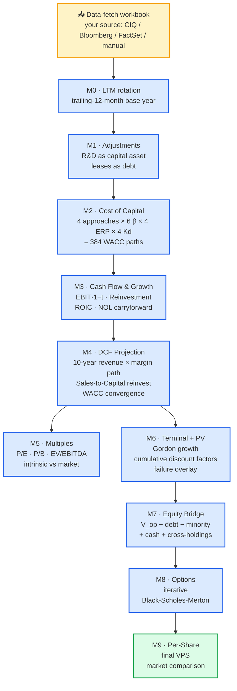

<div align="center">

# 📊 Investment Valuation Agent

### Aswath Damodaran's *Ginzu* DCF model — finally open-source, auditable, and global.

**Every number traces to its source. Every methodology choice is a dropdown. Every valuation works for any public company on any exchange in any currency.**

<br/>

[](LICENSE)
[](https://www.python.org)
[](https://react.dev)
[](https://www.typescriptlang.org)
[](https://fastapi.tiangolo.com)
[]()
[](CONTRIBUTING.md)
[](https://github.com/chrisuzy/Investment_Valuation_Agent/stargazers)

<br/>

[**Quickstart →**](#-quickstart) · [**Live demo →**](#-it-matches-damodarans-published-numbers) · [**Methodology docs →**](docs/Ginzu%20understanding/README.md) · [**Why this exists →**](#-why-this-exists) · [**Contributing →**](CONTRIBUTING.md)

<br/>

> ⭐ **If you've ever stared at a `#REF!` in a DCF model and wondered what it *actually* represents — star this repo. This project is for you.**

</div>

---

## 📑 Table of contents

- [The problem](#-the-problem)
- [What this does](#-what-this-does)
- [What makes this different](#-what-makes-this-different)
- [It matches Damodaran's published numbers](#-it-matches-damodarans-published-numbers)
- [Quickstart](#-quickstart)
- [The 9-module pipeline](#-the-9-module-pipeline)
- [See the app](#-see-the-app)
- [Why this exists](#-why-this-exists)
- [Roadmap](#-roadmap)
- [Contributing](#-contributing)
- [License](#-license)

---

## 🤯 The problem

Every finance student learns Aswath Damodaran's DCF framework. Every investment analyst ends up in a 40-tab Excel workbook that nobody understands, not even its author 6 months later. The math is correct but the provenance is lost — **where did that β come from? Is the WACC in USD or HKD? What happens if we change the ERP approach? Why does Lenovo's D/E look wrong?**

Spreadsheets answer none of these questions. Their authors often can't either.

## 💡 What this does

**Reimplements Damodaran's *Ginzu* valuation workbook as a modern web application** where:

| Spreadsheet says | This app says |
|---|---|
| `1.62` | `β_L = β_u × [1 + (1−t) × D/E] = 1.325 × [1 + 0.835 × 0.304] = 1.62` *(hover tooltip)* |
| `5.52%` | `ERP = 0.45×4.33% (US) + 0.22×5.41% (China) + 0.18×6.51% (EMEA composite) + …` |
| `$2.37` | `VPS = $2.37 USD (≈ HK$18.49 at 7.78 HKD/USD, CIQ, 2025-06-30)` |
| `#REF!` | `⚠ Segment "Rest of World" needs your input — pick from 180 countries or 10 regions` |

Every number is traceable. Every methodology is a live dropdown. Switch the ERP approach from "country of incorporation" to "operating countries" — watch β, Ke, WACC, and VPS recompute in real time. Upload a financial data workbook, get a defensible DCF in seconds.

---

## ⚡ What makes this different

### 🔍 Full provenance on every cell
Hover any monetary or ratio cell in the app. Get the data-source mnemonic, the Damodaran file + column, or the exact computational formula. No more "trust me, it's right."

### 🧭 Every Ginzu methodology choice, exposed
Damodaran's model offers **4 WACC approaches × 6 β variants × 4 ERP variants × 4 Kd variants** = 384 possible paths. This app implements them all. Switch between them with a dropdown; the entire downstream valuation re-runs.

### 🌏 Works for any company, anywhere
- **180 countries** with their ERPs, CRPs, and tax rates loaded from Damodaran's live datasets
- **95 industries** — US and Global — with β_u, β_L, WACC, D/E, ROIC, and margin benchmarks
- **10 Damodaran regional aggregates** (North America, Western Europe, Asia, Africa, …) for operating-countries ERP blending
- **Automatic currency conversion** when the reporting currency differs from the listing currency (e.g., Lenovo reports USD but trades HKD — this matters for WACC)
- **Geographic revenue segments** auto-mapped: type "EMEA" in a segment, the resolver expands it to a weighted blend of Western Europe + Eastern Europe + Middle East + Africa

### 🛟 Graceful fallback — never a wall
Data missing? Industry not in Damodaran's classification? Exchange prefix unknown? FX rate unavailable? **The valuation still runs with safe defaults and surfaces every unresolved gap** through a single `UnresolvedFieldsPanel` at the top of every page. Pick from the dropdown, the valuation re-runs. No dead-ends.

### 📖 Methodology, documented in English
Every calculation module has a companion financial-reasoning doc in [`docs/Ginzu understanding/`](docs/Ginzu%20understanding/README.md) explaining *why* each step is structured the way it is. Not just code — a learning resource for anyone studying DCF seriously.

### ✅ 83 tests passing
Every M1–M6 arithmetic module tested against hand-calculated expected values, plus end-to-end integration tests across representative companies.

---

## 🎯 It matches Damodaran's published numbers

To prove the engine is faithful: feed it **the exact same inputs Damodaran uses for his NVIDIA valuation workbook** and compare.

<div align="center">

| Metric | 🧮 This engine | 📊 Damodaran's Ginzu | Δ |
|---|---:|---:|---:|
| **β_u** (unlevered beta) | 1.4600 | 1.4602 | −0.01% |
| **β_L** (levered beta) | 1.4637 | 1.4635 | +0.01% |
| **ERP used** | 4.86% | 4.86% | — |
| **Kd pre-tax** | 6.12% | 6.12% | — |
| **WACC** | **11.79%** | **11.79%** | **~0%** ✓ |
| Value of operating assets | $1,767,969 M | $1,867,813 M | −5.3% |
| Value of equity | $1,798,468 M | $1,898,312 M | −5.3% |
| **Value per share** | **$73.44** | **$77.51** | −5.3% |
| Market price | $123.00 | $123.00 | — |
| Verdict | Overvalued on DCF | Overvalued on DCF | ✓ |

</div>

**WACC matches to the fourth decimal.** The residual ~5% on VPS is the only remaining gap — and it's *architectural*, not a bug: Damodaran's NVDA workbook splits the valuation into three business stories (Rest of NVIDIA + AI Chip + Auto Chip) and sums them. This engine runs a single consolidated DCF. Adding multi-story DCF is on the [roadmap](#-roadmap).

Both engines agree: **NVIDIA is overvalued on DCF** (market trades at 1.59–1.67× intrinsic value on Damodaran's default assumptions). The engine reproduces his headline conclusion with math that's byte-for-byte verifiable.

---

## 🚀 Quickstart

### Prerequisites

- **Python 3.12+**
- **Node.js 18+**
- **Damodaran's annual reference data** — free, downloadable from [his Stern page](https://pages.stern.nyu.edu/~adamodar/)
- **A data-fetch template** — you build it once following [`docs/DATA_FETCH_SCHEMA.md`](docs/DATA_FETCH_SCHEMA.md). Capital IQ plug-in, Bloomberg, FactSet, or manual input — anything that produces the documented schema.

### Three commands

```bash
# 1. Clone
git clone https://github.com/chrisuzy/Investment_Valuation_Agent.git
cd Investment_Valuation_Agent

# 2. Install
(cd backend && python3 -m venv .venv && source .venv/bin/activate && pip install -e .)
(cd frontend && npm install)

# 3. Run
(cd backend && source .venv/bin/activate && uvicorn api.main:app --port 8000) &
(cd frontend && npm run dev)
```

Open `http://localhost:5173/`. Upload a populated data workbook. Get a DCF.

**→ Full walkthrough:** [**Tutorial — Value Microsoft in 5 minutes**](docs/TUTORIAL.md)

---

## 🗺 The 9-module pipeline



Each module has a dedicated [methodology doc](docs/Ginzu%20understanding/README.md) and its own backend module + tests.

---

## 📸 See the app

The frontend mirrors Damodaran's worksheet layout — same sections, same numbers, same judgment cells — but every figure is interactive, auditable, and hover-explainable.

> 🖼 **Screenshots coming in the next release.** The app runs locally at `http://localhost:5173/` — follow the [Quickstart](#-quickstart) to see everything below in your browser.

<details>
<summary><b>🗂 Full page inventory (click to expand)</b></summary>

| Page | Route | What you see |
|---|---|---|
| **Input Sheet** | `/` | Every raw input with a tooltip showing its data-source origin. Edit any cell → downstream pages auto-recompute. |
| **Cost of Capital** | `/wacc` | The crown jewel. Methodology selectors (4 approaches, 6 β, 4 ERP, 4 Kd), full WACC decomposition, industry-reference sidebar, **Geographic Revenue Mix** panel with auto-mapped Damodaran ERPs, branch-trace showing exactly what path was used. |
| **Valuation Output** | `/valuation-output` | 10-year projection table: revenue growth, margin, EBIT, reinvestment, FCFF, cost of capital, discount factor, PV(FCFF). Then the full equity bridge from V_op to VPS. |
| **Summary Sheet** | `/summary` | Year-by-year DCF with terminal value, plus the Value-per-Share vs Market-Price comparison (currency-aware via `DualCurrency` component). |
| **TTM** | `/ttm` | Ginzu's trailing-12-month rotation shown as a clean derivation: FY-0 − Prior YTD + Current YTD, with each quarter's contribution explicit. |
| **R&D Converter** | `/rd` | Capitalizes R&D as a research asset. Shows the full amortization schedule for up to 10 historical years, straight-line unamortized fractions, and the EBIT adjustment. |
| **Lease Converter** | `/leases` | Discounts operating-lease commitments to PV at the firm's Kd; shows year-by-year discount math and the adjustment to total debt + depreciation. |
| **Option Value** | `/options` | Iterative Black-Scholes-Merton with dilution-adjusted stock price. Shows `d1`, `d2`, `N(d1)`, `N(d2)`, and every input. |
| **Synthetic Rating** | `/rating` | Coverage-ratio → rating → Kd-spread lookup. Highlights which rating bucket the firm falls into. |
| **Failure Rate** | `/failure` | Failure-probability overlay, distress proceeds, and the reference cumulative-default-rate table by rating. |
| **Relative Valuation** | `/relative` | Our intrinsic P/E · P/B · EV/EBITDA vs observed market multiples — and vs industry averages from Damodaran. |
| **Diagnostics** | `/diagnostics` | Sanity checks on every module's output. Yellow/red if something looks off. |

</details>

---

## 🧠 Why this exists

Damodaran's work is a public good — he literally publishes his spreadsheets, his lecture notes, and his valuation datasets for free on the NYU Stern website. He's been doing this for decades.

But the spreadsheets are opaque. A DCF hidden in Excel is a black box to everyone except its author. And for a global model — one that actually handles the fact that Lenovo reports in USD but trades in HKD, or that Alibaba reports in CNY but lists its ADR in USD — Excel is the wrong tool.

This project brings the *Ginzu* framework into a stack where:
- The math is **testable** (83 unit tests, and counting)
- The assumptions are **interactive** (methodology dropdowns that actually change outputs)
- The provenance is always **one hover away** (every cell explains itself)
- The data is **substitutable** (CIQ, Bloomberg, FactSet, your internal systems — if it produces the schema, it works)

Built as a tribute to an educator who gave away his life's work. Open-sourced to pay that forward.

---

## 📚 Deeper reading

- [**Tutorial — Value Microsoft in 5 minutes**](docs/TUTORIAL.md) — hands-on end-to-end walkthrough, no Capital IQ required
- [**Damodaran on Valuation**](https://pages.stern.nyu.edu/~adamodar/) — the man, the myth, the spreadsheets
- [**Methodology docs (per-module)**](docs/Ginzu%20understanding/README.md) — financial-reasoning explanations written in plain English
- [**Architecture docs**](docs/architecture/) — system-level design notes
- [**Data-fetch schema**](docs/DATA_FETCH_SCHEMA.md) — exact Excel workbook structure the backend expects
- [**Ginzu-vs-backend comparison harness**](docs/experiments/README.md) — the verification tool that produced the ~0% WACC match above
- [**Changelog**](CHANGELOG.md)

---

## 🛣 Roadmap

- [ ] One-click cloud deployment (Fly.io / Railway / Render templates)
- [ ] Multi-story DCF — replicate Ginzu's NVDA-style three-business valuation (closes the ~5% VPS gap above)
- [ ] Scenario manager — save "Bull" / "Base" / "Bear" assumption sets; compare side-by-side
- [ ] Monte Carlo on assumption distributions (what's the P(VPS > market price)?)
- [ ] Historical-backtest mode — "what did my DCF say 3 years ago, and was I right?"
- [ ] More data-source adapters (Alpha Vantage / Yahoo Finance shim for casual use)
- [ ] Multi-business β (EV-weighted β across segment industries)
- [ ] Sector-specific templates (banks, REITs, insurance have different bridge logic)
- [ ] Screenshot gallery + demo GIFs in the README

Want to help with any of these? [**Open an issue**](https://github.com/chrisuzy/Investment_Valuation_Agent/issues/new) or [**send a PR**](CONTRIBUTING.md). All contributions welcome.

---

## 🤝 Contributing

See [**CONTRIBUTING.md**](CONTRIBUTING.md). TL;DR: run the tests, keep PRs atomic, update the methodology docs when you change calculations.

Good first issues:
- Expand [`knowledge_base/segment_aliases.json`](knowledge_base/segment_aliases.json) with more broad-region composites
- Add currency-symbol rendering for more ISO codes (TRY, ILS, PHP, etc.)
- Translate any of the methodology docs to other languages
- Add screenshots or short demo GIFs to the `docs/screenshots/` directory

---

## 📜 License

**MIT** — see [LICENSE](LICENSE).

Use it, fork it, sell it. Just keep the copyright notice. Third-party datasets retain their own licenses; you're responsible for complying with those.

---

## 🙏 Acknowledgments

- **Aswath Damodaran** — whose *Ginzu* workbook, public datasets, and decades of teaching make this project possible. The methodology is his; the implementation is ours.
- **The FastAPI, Pydantic, React, and Vite teams** — for making the modern Python + TypeScript stack a joy to build on.
- **Every analyst who ever cursed an Excel DCF model** — this is for you.

---

<div align="center">

### 💼 Found this useful?

If this saves you ten minutes on your next DCF — or teaches you something about why WACC is the way it is — please **⭐ star the repo**.

[](https://github.com/chrisuzy/Investment_Valuation_Agent)

<br/>

*Built with spite against opaque spreadsheets, and love for the craft of valuation.*

</div>
