# Project Status Review — Comprehensive End-to-End Audit

**Date:** 2026-04-28
**Purpose:** Consolidated review of what has been built vs. what is required to deliver a Ginzu-fidelity intrinsic valuation system. Combines: (a) canonical workflow sequence, (b) per-step backend + frontend status, (c) gap analysis, (d) dependency-ordered roadmap.

**Anchors:**
- **Ground truth spec:** `docs/ginzu_spec_v2.md` (15 sections, Ginzu-authoritative)
- **Textbook deltas:** `docs/textbook_corrections.md` (17 items)
- **Previous roadmap:** `docs/project_plan_v2.md` (8 phases, ~60 hrs)
- **Extraction corpus:** `docs/brainstorm_cache/ginzu_extracted.json` (1,675 formulas)
- **Per-stage findings:** `docs/brainstorm_cache/stage_{1..6}_findings.md`

---

## 1. Executive Summary

**Five-bullet TL;DR:**

- **Data-acquisition layer (Module 0) is functionally complete** — CIQ template generation + upload + parsing works end-to-end on Linux. Damodaran industry + country data fully loaded (244 files across 8 regions).
- **Adjustment layer (Module 1: R&D + leases) is correct** — formulas match Ginzu exactly, covered by 19 passing tests.
- **Cost of capital layer (Module 2) covers ~15% of Ginzu's functionality** — Approach 1 single-business / single-country / no-bond-pricing / no-preferred / no-synthetic-rating. Four major Stage 3 variants missing.
- **DCF projection layer (Module 4) is the primary defect** — **17 of 27 user story fields are silently ignored**; EBIT mechanic is fundamentally wrong (compounds growth instead of Revenue × Margin); no NOL, no tax convergence, no margin path, no WACC path, no reinvestment lag, no invested-capital tracking. Same value per share produced regardless of most user inputs.
- **Frontend has 13 pages and ~2,800 LOC** — all Ginzu sheets except **Summary Sheet**, **Relative Valuation**, **Country Risk Blender**, and **Industry Browser** are represented. Several existing pages (SyntheticRating, FailureRate) do math in the browser without feedback to the engine.

**Bottom line:** the plumbing is built. The payload (M4 DCF) is broken. One focused engine rewrite (~7 hrs of Phase 1) unblocks everything.

---

## 2. Canonical Workflow Sequence (Dependency Graph)

All downstream outputs trace back through this DAG. Numbered nodes correspond to §s of `ginzu_spec_v2.md`.

```mermaid
flowchart TD
    classDef done fill:#10b981,stroke:#064e3b,color:#fff
    classDef partial fill:#f59e0b,stroke:#78350f,color:#000
    classDef broken fill:#ef4444,stroke:#7f1d1d,color:#fff
    classDef missing fill:#9ca3af,stroke:#1f2937,color:#fff
    classDef input fill:#3b82f6,stroke:#1e3a8a,color:#fff

    %% === INPUTS LAYER ===
    subgraph Inputs["① Data acquisition (Module 0)"]
        A1[Ticker + country + industry lookup]:::done
        A2[Macro: riskfree, ERP, CRP, marginal tax]:::done
        A3[Industry: beta_u, WACC, margins, S/C, ROIC]:::done
        A4[CIQ fetch via template upload]:::done
        A5[10 years annual + 8 quarters raw financials]:::done
    end

    %% === LTM LAYER ===
    subgraph LTM["② LTM normalization"]
        B1[Quarterly → LTM flows]:::done
        B2[Base-year balance sheet point-in-time]:::done
    end
    A5 --> B1
    A5 --> B2

    %% === ADJUSTMENTS LAYER ===
    subgraph Adj["③ Financial adjustments"]
        C1[R&D capitalization: value_of_research_asset,<br/>amortization, adjusted EBIT]:::done
        C2[Operating lease conversion: pv_leases,<br/>depreciation_on_lease, adjusted EBIT + debt]:::partial
        C2b[Lease depreciation → adjusted D&A]:::broken
    end
    B1 --> C1
    B1 --> C2
    C2 --> C2b

    %% === COST OF CAPITAL LAYER ===
    subgraph COC["④ Cost of capital (Module 2)"]
        D1[Unlevered beta]:::partial
        D1a[Multi-business EV-weighted β]:::missing
        D1b[Direct input β]:::missing
        D2[Equity risk premium]:::partial
        D2a[Multi-country revenue-weighted ERP]:::missing
        D2b[Multi-region revenue-weighted ERP]:::missing
        D3[Pre-tax Kd: direct / industry / synthetic / rating]:::partial
        D3a[Synthetic rating feedback loop]:::broken
        D3b[Actual rating → spread]:::missing
        D4[Bond-priced MV of debt]:::missing
        D4a[Convertible debt decomposition]:::missing
        D5[Preferred stock → MV, weight, cost]:::missing
        D6[Market weights + CAPM + after-tax Kd + WACC]:::done
    end
    A2 --> D1
    A2 --> D2
    A2 --> D3
    A3 --> D1
    C1 --> D6
    C2 --> D4
    D1 --> D6
    D2 --> D6
    D3 --> D4
    D4 --> D6
    D5 --> D6

    %% === STORY LAYER (user inputs) ===
    subgraph Story["⑤ User story (Input sheet §1)"]
        S1[Growth: revenue_growth_next_year, years_2_5]:::input
        S2[Margin: margin_next_year, target, convergence_year]:::input
        S3[Efficiency: S/C years 1-5, years 6-10]:::input
        S4[Terminal overrides: WACC, ROIC, g, RF]:::input
        S5[Failure: probability, tie_to, proceeds_pct]:::input
        S6[Tax: effective, override convergence]:::input
        S7[NOL: initial amount]:::input
        S8[Reinvestment lag: 0-3 years]:::input
        S9[Trapped cash: amount + foreign tax]:::input
    end

    %% === DCF PROJECTION LAYER ===
    subgraph DCF["⑥ 10-year DCF projection (Module 4) 🔴 PRIMARY DEFECT"]
        E1[Revenue path: years 1-5 flat, 6-10 converge]:::broken
        E2[Operating margin path: linear to target by year K]:::broken
        E3[Operating income = Revenue × Margin]:::broken
        E4[Tax rate path: effective → marginal convergence]:::broken
        E5[NOL dynamic carryforward]:::broken
        E6[NOPAT NOL-aware]:::broken
        E7[Sales-to-Capital reinvestment with lag 0-3]:::broken
        E8[FCFF = NOPAT - Reinvestment]:::done
        E9[WACC path: years 1-5 flat, 6-10 converge]:::broken
        E10[Invested capital path]:::missing
        E11[ROIC path]:::missing
    end
    S1 --> E1
    S2 --> E2
    S3 --> E7
    S4 --> E9
    S6 --> E4
    S7 --> E5
    S8 --> E7
    D6 --> E9
    C1 --> E10
    C2 --> E10
    E1 --> E2
    E2 --> E3
    E3 --> E5
    E4 --> E6
    E5 --> E6
    E3 --> E6
    E6 --> E8
    E7 --> E8
    E9 --> E8

    %% === TERMINAL LAYER ===
    subgraph Terminal["⑦ Terminal value"]
        F1[Terminal WACC: default = RF + mature_market_ERP]:::broken
        F2[Terminal ROIC: default = terminal WACC]:::done
        F3[Terminal RIR = g_T / ROIC_T]:::done
        F4[Terminal FCFF = NOPAT_T × 1-RIR]:::done
        F5[TV = FCFF_T / WACC_T - g_T]:::done
    end
    S4 --> F1
    E1 --> F4
    F1 --> F5

    %% === DISCOUNTING ===
    subgraph PV["⑧ Discount to PV"]
        G1[Cumulative discount factor year-by-year product]:::broken
        G2[PV of each FCFF]:::partial
        G3[PV of TV]:::partial
        G4[Value as going concern = Σ PV_FCFF + PV_TV]:::done
    end
    E9 --> G1
    F1 --> G1
    E8 --> G2
    G1 --> G2
    F5 --> G3
    G1 --> G3
    G2 --> G4
    G3 --> G4

    %% === FAILURE + BRIDGE + OPTIONS ===
    subgraph Bridge["⑨ Failure + equity bridge"]
        H1[Failure overlay: p, distress by B or V, applied to going concern]:::broken
        H2[Debt total = BV_debt + lease_PV]:::done
        H3[Minus minority interests]:::broken
        H4[Trapped cash adjustment to usable cash]:::broken
        H5[Plus cash_usable, plus cross_holdings]:::partial
        H6[Equity before options]:::partial
    end
    S5 --> H1
    S9 --> H4
    G4 --> H1
    H1 --> H6
    H2 --> H6
    H3 --> H6
    H4 --> H5
    H5 --> H6

    subgraph Options["⑩ Options dilution (iterative BSM)"]
        I1[Dilution-adjusted stock price iteration]:::broken
        I2[Black-Scholes call value]:::done
        I3[Value of all options = C × N]:::done
    end
    H6 --> I1
    I1 --> I2
    I2 --> I3

    %% === FINAL ===
    subgraph Final["⑪ Per-share + diagnostics"]
        J1[Value of equity in common = equity - options]:::done
        J2[Value per share = equity_common / shares]:::done
        J3[Price as pct of value]:::done
        J4[Sanity checks § 15]:::partial
        J5[PV of NOPAT, value effect of reinvestment]:::missing
    end
    H6 --> J1
    I3 --> J1
    J1 --> J2
    J2 --> J3
    E6 --> J5
    E8 --> J5
    G1 --> J5
```

**Legend:**
- 🟢 `done` — matches Ginzu, tested
- 🟡 `partial` — works but incomplete (missing variants or edge cases)
- 🔴 `broken` — wrong formula or dead schema field; produces incorrect number
- ⬜ `missing` — not implemented at all
- 🔵 `input` — user-provided (not a compute node)

---

## 3. Per-Step Status Matrix

One row per canonical workflow step. Each row: backend status, frontend status, owning module, plan phase to close.

### 3.1 ① Data Acquisition

| # | Step | Backend | Frontend | Module | Plan phase |
|---|---|---|---|---|---|
| 1.1 | Ticker + name + country lookup | ✅ `industry_mapper.py` | ✅ search UI in App.tsx | M0 | — |
| 1.2 | Macro data (RF, ERP, CRP, marginal tax) | ✅ `country_risk_parser.py`, `country_tax_parser.py` | ✅ shown on InputSheet.tsx | M0 | — |
| 1.3 | Industry data (β_u, WACC, margins, S/C, ROIC, multiples) | ✅ 11 Damodaran parsers | ✅ InputSheet shows industry data US + Global | M0 | — |
| 1.4 | CIQ template generation | ✅ `generate_ciq_template.py` (247 formulas) | ✅ download button | M0 | A |
| 1.5 | Resolved-template upload + parse | ✅ `read_ciq_template.py` + `/fetch-from-file` endpoint | ✅ upload button + state | M0 | A |
| 1.6 | 10 annual + 8 quarterly rows | ✅ parsed into RawFinancials | ✅ InputSheet historical table | M0 | — |
| 1.7 | Regional Damodaran aggregates (10 regions) | ❌ not parsed | ❌ N/A | — | 4.3 |
| 1.8 | Rating tables (ratings.xls, synthrating.xls) | ❌ not loaded | ❌ N/A | — | 4.2 |

### 3.2 ② LTM Normalization

| # | Step | Backend | Frontend | Module | Plan phase |
|---|---|---|---|---|---|
| 2.1 | LTM = 10K + current_YTD − prior_YTD | ✅ `ltm_calculator.py` | ✅ TrailingTwelveMonth.tsx shows derivation | M0 | — |
| 2.2 | Balance-sheet point-in-time | ✅ uses FQ-0 directly | ✅ shown | M0 | — |

### 3.3 ③ Financial Adjustments

| # | Step | Backend | Frontend | Module | Plan phase |
|---|---|---|---|---|---|
| 3.1 | R&D: unamortized, amortization, value_of_research_asset | ✅ `capitalize_r_and_d()` | ✅ RDConverter.tsx | M1 | — |
| 3.2 | R&D → adjusted EBIT, NI, BV equity | ✅ | ✅ | M1 | — |
| 3.3 | Lease PV (Yr1-5 + annuity) | ✅ `capitalize_operating_leases()` | ✅ LeaseConverter.tsx | M1 | — |
| 3.4 | Lease edge case n_additional=0 | ⚠️ `max(1, ...)` floor diverges from Ginzu | N/A | M1 | 1.21 |
| 3.5 | Lease depreciation → adjusted EBIT offset | ✅ `lease_adjustment_to_ebit` | ✅ shown | M1 | — |
| 3.6 | Lease depreciation → adjusted D&A (for reinvestment) | 🔴 not added to `adjusted_d_a` | ❌ not displayed | M3 | 1.18 |

### 3.4 ④ Cost of Capital

| # | Step | Backend | Frontend | Module | Plan phase |
|---|---|---|---|---|---|
| 4.1 | Approach selector (Direct / Detailed / Industry / Decile) | ❌ only Detailed with industry-fallback | ❌ not exposed | M2 | 3.7 |
| 4.2 | Unlevered β — single-business US | ✅ | ✅ CostOfCapital.tsx | M2 | — |
| 4.3 | Unlevered β — single-business Global | ✅ via region param | ✅ via region | M2 | — |
| 4.4 | Unlevered β — multi-business (EV-weighted) | ❌ | ❌ | M2 | 3.1 |
| 4.5 | Unlevered β — direct input | ❌ | ❌ | M2 | 3.2 |
| 4.6 | ERP — country of incorporation | ✅ | ✅ | M2 | — |
| 4.7 | ERP — multi-country revenue-weighted | ❌ | ❌ need new page | M2 | 3.3 + 5.3 |
| 4.8 | ERP — multi-region revenue-weighted | ❌ | ❌ | M2 | 3.3 |
| 4.9 | ERP — direct input | ❌ | ❌ | M2 | 3.2 |
| 4.10 | Pre-tax Kd — industry fallback | ✅ | ✅ | M2 | — |
| 4.11 | Pre-tax Kd — synthetic rating (coverage → rating → spread) | ❌ | ⚠️ SyntheticRating.tsx (browser-only math) | M2 | 2.1, 2.2, 5.5 |
| 4.12 | Pre-tax Kd — actual rating lookup | ❌ | ❌ | M2 | 2.1 |
| 4.13 | Pre-tax Kd — direct input | ❌ | ❌ | M2 | 3.2 |
| 4.14 | MV of debt — book value (shortcut) | ✅ | ✅ | M2 | — |
| 4.15 | MV of debt — bond pricing | ❌ | ❌ | M2 | 3.4 |
| 4.16 | Convertible debt decomposition | ❌ | ❌ | M2 | 3.6 |
| 4.17 | MV of equity | ✅ | ✅ | M2 | — |
| 4.18 | Preferred stock MV + weight + cost | ❌ | ❌ | M2 | 3.5 |
| 4.19 | Market weights, levered β, CAPM, after-tax Kd, WACC blend | ✅ | ✅ | M2 | — |
| 4.20 | WACC feedback loop (synthetic → Kd → WACC) | ❌ single-pass | ❌ | M2 | 2.1-2.3 |

### 3.5 ⑥ DCF Projection (PRIMARY DEFECT AREA)

| # | Step | Backend | Frontend | Module | Plan phase |
|---|---|---|---|---|---|
| 6.1 | Revenue path years 1-5 from `revenue_growth_next_year` | 🔴 uses M3 `expected_growth_ebit` instead | ⚠️ InputSheet accepts input but ignored | M4 | 1.4 |
| 6.2 | Revenue path years 2-5 from `revenue_growth_years_2_5` | 🔴 **field never read** | ⚠️ accepted but ignored | M4 | 1.5 |
| 6.3 | Revenue path years 6-10 linear convergence to g_terminal | ⚠️ convergence logic exists but starts from wrong g | ❌ not visualized | M4 | 1.4-1.5 |
| 6.4 | Margin year 1 from `operating_margin_next_year` | 🔴 **field never read** | ⚠️ accepted but ignored | M4 | 1.1 |
| 6.5 | Margin convergence to `target_operating_margin` by year K | 🔴 **fields never read** | ⚠️ accepted but ignored | M4 | 1.2 |
| 6.6 | Operating Income = Revenue × Margin | 🔴 uses `ebit_prev × (1+g)` | ❌ not exposed | M4 | 1.3 |
| 6.7 | Effective tax years 1-5, linear convergence to marginal | 🔴 uses flat marginal | ❌ not exposed | M4 | 1.6, 1.7 |
| 6.8 | `override_tax_convergence` honored | 🔴 **field never read** | ⚠️ accepted but ignored | M4 | 1.6 |
| 6.9 | NOL initial from `nol_amount` | 🔴 **field never read** | ⚠️ accepted but ignored | M4 | 1.8 |
| 6.10 | NOL dynamic carryforward | ❌ not implemented | ❌ not exposed | M4 | 1.8 |
| 6.11 | NOPAT with NOL absorption | ❌ not implemented | ❌ | M4 | 1.8 |
| 6.12 | Reinvestment = ΔRevenue / S/C | 🔴 uses `nopat × rir` (wrong) | ❌ | M4 | 1.9 |
| 6.13 | `sales_to_capital_high/stable` honored | 🔴 **fields never read** | ⚠️ accepted but ignored | M4 | 1.9 |
| 6.14 | Reinvestment lag 0-3 years | 🔴 **fields never read** | ⚠️ accepted but ignored | M4 | 1.9 |
| 6.15 | FCFF = NOPAT − Reinvestment | ✅ | ❌ per-year not visualized | M4 | — |
| 6.16 | WACC path years 6-10 convergence to terminal | 🔴 uses flat WACC | ❌ | M4 | 1.10 |
| 6.17 | Default terminal WACC = RF + mature_market_ERP | 🔴 defaults to initial WACC | ❌ | M4 | 1.13 |
| 6.18 | `override_riskfree` + `riskfree_after_yr10` honored | 🔴 **fields never read** | ⚠️ accepted but ignored | M4 | 1.13 |
| 6.19 | `override_growth_perpetuity` honored | 🔴 **field never read** | ⚠️ accepted but ignored | M4 | 1.14 |
| 6.20 | Invested capital path | ❌ not tracked | ❌ | M4 | 1.12 |
| 6.21 | ROIC path | ❌ not tracked | ❌ | M4 | 1.12 |
| 6.22 | Terminal ROIC default = terminal WACC | ✅ correct in our code | ❌ | M4 | — |

### 3.6 ⑧ Discounting

| # | Step | Backend | Frontend | Module | Plan phase |
|---|---|---|---|---|---|
| 8.1 | Cumulative discount factors year-by-year product | 🔴 uses `1/(1+wacc)^t` closed form | ❌ | M4 | 1.11 |
| 8.2 | PV of each year's FCFF | ⚠️ correct IF wacc constant | ❌ per-year not shown | M4 | 1.11 |
| 8.3 | PV of terminal value | ⚠️ correct IF wacc constant | ✅ shown as total | M4 | 1.11 |
| 8.4 | value_as_going_concern = Σ PV + PV_TV | ✅ | ✅ ValuationOutput shows | M4 | — |

### 3.7 ⑨ Failure + Bridge

| # | Step | Backend | Frontend | Module | Plan phase |
|---|---|---|---|---|---|
| 9.1 | Failure overlay applied to going concern BEFORE bridge | 🔴 applied AFTER bridge to equity | ⚠️ FailureRate.tsx browser-only | M4 | 1.15 |
| 9.2 | `failure_tie_to = "B"` (book value) branch | 🔴 **field never read** | ⚠️ browser-only | M4 | 1.15 |
| 9.3 | `failure_tie_to = "V"` (fair value) branch | ✅ (the only one implemented) | ✅ | M4 | — |
| 9.4 | Debt total = BV_debt + lease_PV | ✅ | ✅ | M4 | — |
| 9.5 | − Minority interests | 🔴 `raw.minority_interests` **never subtracted** | ❌ | M4 | 1.16 |
| 9.6 | + Cash_usable with trapped-cash adjustment | 🔴 trapped cash fields **never read** | ⚠️ fields accepted | M4 | 1.17 |
| 9.7 | + Cross holdings / non-operating assets | 🔴 `raw.cross_holdings` **never added** | ❌ | M4 | 1.16 |
| 9.8 | Value of equity (pre-options) | ⚠️ incomplete due to 9.5/9.6/9.7 | ✅ shown | M4 | 1.15-1.17 |

### 3.8 ⑩ Options Dilution

| # | Step | Backend | Frontend | Module | Plan phase |
|---|---|---|---|---|---|
| 10.1 | Dilution-adjusted S iterative fixed-point | 🔴 one-shot (no iteration) | ✅ OptionValue.tsx displays | M6 | 2.4 |
| 10.2 | Seed = market price (Ginzu) vs intrinsic (ours) | ⚠️ uses intrinsic; design question | ✅ | M6 | 2.4 |
| 10.3 | Black-Scholes formula | ✅ | ✅ | M6 | — |
| 10.4 | Value of all options = call × warrants | ✅ | ✅ | M6 | — |

### 3.9 ⑪ Per-Share + Diagnostics

| # | Step | Backend | Frontend | Module | Plan phase |
|---|---|---|---|---|---|
| 11.1 | Value of equity in common = equity − options | ✅ | ✅ | M6 | — |
| 11.2 | Value per share | ✅ | ✅ ValuationOutput.tsx | M6 | — |
| 11.3 | Price as pct of value | ⚠️ computed in frontend only | ✅ | — | — |
| 11.4 | Sanity checks (§15) | ⚠️ partial in Diagnostics.tsx | ⚠️ not auto-flagged | — | 5.7 |
| 11.5 | PV of NOPAT, value effect of reinvestment | ❌ not computed | ❌ not shown | — | 5.7 |

### 3.10 Frontend Pages Inventory

| Page (file) | LOC | Maps to Ginzu sheet | Current role | Missing functionality |
|---|---:|---|---|---|
| `InputSheet.tsx` | 811 | Input sheet | Primary input entry, shows base year + story + overrides | No benchmark reference columns (I/J/K/L/M/N); effective tax rate shown but dead |
| `TrailingTwelveMonth.tsx` | 282 | Trailing 12 month | Show LTM derivation | — |
| `RDConverter.tsx` | 145 | R& D converter | Show R&D capitalization calc | — |
| `LeaseConverter.tsx` | 166 | Operating lease converter | Show lease PV derivation | — |
| `CostOfCapital.tsx` | 160 | Cost of capital worksheet | Show WACC components | Only Approach 1 single-biz; no preferred, no bond pricing, no convertibles |
| `SyntheticRating.tsx` | 83 | Synthetic rating | Browser-side lookup display | Not wired to engine |
| `FailureRate.tsx` | 90 | Failure Rate worksheet | Browser-side failure probability pick | Not wired to engine output; no reference table visualization |
| `StoriesToNumbers.tsx` | 135 | Stories to Numbers | Narrative labels over assumptions | Thin; labels static |
| `ValuationPicture.tsx` | 119 | Valuation as picture | Visual equity bridge | Thin |
| `ValuationOutput.tsx` | 278 | Valuation output (bridge) | End-to-end summary | Shows aggregates, no year-by-year DCF table |
| `OptionValue.tsx` | 213 | Option value | BSM display | No iteration visualization |
| `Diagnostics.tsx` | 218 | Diagnostics | Sanity checks | Incomplete vs §15; missing PV-of-NOPAT metrics |
| `AnswerKeys.tsx` | 97 | Answer keys | Key inputs + outputs summary | Thin |

**Missing frontend pages:**

| Proposed page | Data source | Plan phase |
|---|---|---|
| `SummarySheet.tsx` — year-by-year DCF table | `DCFResult.revenue_projections` + new `ic_path`, `roic_path` | 5.1 |
| `RelativeValuation.tsx` | `MultiplesResult` already computed | 5.2 |
| `CountryRiskBlender.tsx` | New endpoint + Damodaran regional aggregates | 5.3 + 3.3 + 4.3 |
| `IndustryAveragesBrowser.tsx` | Existing Damodaran store | 5.4 |
| Tornado / Monte Carlo sensitivity | New engine + new UI | 6.3, 6.4 |

---

## 4. Gap Analysis — Where We Stand

### 4.1 Completeness scorecard (by Ginzu sheet)

| Ginzu sheet | Backend fidelity | Frontend fidelity | Overall |
|---|---:|---:|---:|
| Input sheet | 100% | 85% (no benchmark cols) | **90%** |
| Trailing 12 month | 100% | 100% | **100%** |
| R& D converter | 100% | 100% | **100%** |
| Operating lease converter | 95% (n_additional=0 edge) | 100% | **97%** |
| Cost of capital worksheet | 15% (Approach 1 single-biz only) | 30% | **22%** |
| Synthetic rating | 0% (not wired) | 30% (static display) | **15%** |
| Country equity risk premiums | 60% (country rows only, not regional aggregates) | 50% (shown on InputSheet) | **55%** |
| **Valuation output (DCF core)** | **~25%** (correct math for some cells, wrong mechanic for core) | **40%** (summary OK, no year-by-year) | **30%** |
| Failure Rate worksheet | 0% (no auto-derivation; manual-entry flow matches Ginzu though) | 20% (static tables not shown) | **10%** |
| Option value | 70% (no iteration) | 80% | **75%** |
| Summary Sheet (year-by-year) | N/A (data exists) | 0% (page missing) | **0%** |
| Diagnostics | 40% (some metrics) | 60% | **50%** |
| Valuation as picture | 100% | 70% | **85%** |
| Stories to Numbers | N/A | 60% | **60%** |
| Answer keys | N/A | 70% | **70%** |

**Weighted overall Ginzu fidelity: ~45%**, dragged down primarily by the DCF core and Cost of Capital variants.

### 4.2 Critical path gaps (blocking gaps in dependency order)

These gaps block downstream work; fix them first.

| Gap ID | Description | Blocks |
|---|---|---|
| **G1** | M4 DCF rewrite (§6 of spec) | Any useful numerical output; NVIDIA ground-truth test; Diagnostics; Summary Sheet |
| **G2** | Equity bridge completion (§9) | Correct per-share value; Options dilution convergence |
| **G3** | Terminal WACC default dispatch | Terminal value; PV calculation |
| **G4** | Invested capital path tracking | ROIC path → terminal RIR; Diagnostics; Summary Sheet |
| **G5** | Synthetic rating → Kd feedback loop | Kd correctness for unrated firms → WACC → DCF |
| **G6** | Option dilution iteration | Accurate option dilution effect on per-share value |
| **G7** | Summary Sheet frontend page | User auditability of the DCF (no way to see year-by-year today) |
| **G8** | Multi-business β | Multi-segment firms (NVIDIA, conglomerates) |
| **G9** | Multi-country ERP | Multinationals |
| **G10** | Credit + stats datasets loaded | G5 (synthetic rating), future sensitivity work |

### 4.3 Non-blocking gaps

These can be addressed any time without cascading:
- Lease `n_additional = 0` edge case (very rare firms)
- Approach 2 / Approach 3 WACC (users can pick Approach 1)
- Convertible debt (not all firms have it)
- Preferred stock (not all firms have it)
- Benchmark reference columns on InputSheet (nice-to-have UX)
- Sensitivity / Monte Carlo (advanced feature)

---

## 5. Dependency-Ordered Roadmap

Re-sequencing `project_plan_v2.md` phases by strict dependency. Parallel tracks shown where work can happen concurrently.

### Phase ordering visualization

```mermaid
gantt
    title Dependency-Ordered Roadmap (working days)
    dateFormat X
    axisFormat %d

    section Foundation
    Verify Phase A data acquisition  :done, a, 0, 1d
    Phase 1 DCF rewrite (21 tasks)   :crit, p1, after a, 7d

    section Feedback loops
    Phase 4.2 credit datasets        :p42, after p1, 2d
    Phase 2.1 rating tables parser   :p21, after p42, 1d
    Phase 2.2 + 2.3 synthetic rating :p22, after p21, 1d
    Phase 2.4 options iteration      :p24, after p1, 1d

    section Stage 3 variants (parallel)
    Phase 3.1 multi-business beta    :p31, after p1, 1d
    Phase 3.3 multi-country ERP      :p33, after p1, 1d
    Phase 3.4 bond-priced MV debt    :p34, after p1, 1d
    Phase 3.5 preferred stock        :p35, after p1, 1d
    Phase 3.6 convertibles           :p36, after p1, 1d

    section UI surfaces
    Phase 5.1 Summary Sheet          :p51, after p1, 1d
    Phase 5.2 Relative Valuation    :p52, after p1, 1d
    Phase 5.5 Synthetic rating UI    :p55, after p22, 1d
    Phase 5.6 Failure rate UI        :p56, after p1, 1d
    Phase 5.7 Diagnostics expansion  :p57, after p1, 1d
    Phase 5.3 Country Risk Blender   :p53, after p33, 1d
    Phase 5.4 Industry browser       :p54, after p1, 1d

    section Advanced
    Phase 6 statistical layer        :p6, after p5, 4d
    Phase 7 Excel export             :p7, after p3, 5d
    Phase 8 Windows fetch-agent      :p8, 0, 1d
```

### 5.1 Critical path (sequential)

**The shortest path to Ginzu-fidelity-minus-variants:**

1. **Phase A — Verify data acquisition (1 hr)** — ensure template upload + parse works. No blockers.
2. **Phase 1 — DCF rewrite (7 hrs)** — closes the primary defect. This is the single highest-leverage work.
3. **Phase 5.1 — Summary Sheet frontend (2 hrs)** — unlocks auditability of Phase 1 output. Without this, users cannot inspect the fix.
4. **NVIDIA ground-truth test** — included in Phase 1 Task 1.20. Validates the rewrite.

**13 hours → 90% valuation fidelity for single-business single-country firms.**

### 5.2 Secondary critical path

5. **Phase 4.2 — Damodaran credit datasets (2 hrs)** — prerequisite for synthetic rating.
6. **Phase 2.1 + 2.2 + 2.3 — Synthetic rating + feedback loop (2 hrs)** — fixes Kd for unrated firms.
7. **Phase 2.4 — Option dilution iteration (1 hr)** — closes remaining accuracy gap.

**~5 more hours → 95% fidelity.**

### 5.3 Parallelizable tracks (after Phase 1 lands)

Once Phase 1 ships, these can run concurrently (independent of each other):

- **Stage 3 variants track:** Phases 3.1 → 3.6 (each ~1 hr, total ~5 hrs).
- **UI surfaces track:** Phase 5.1, 5.2, 5.6, 5.7 (total ~5 hrs).
- **Data intake track:** Phase 4.1 (CIQ template additions), 4.3 (regional aggregates), 4.4 (read_ciq_template enhancements) (total ~3 hrs).

A single engineer can complete the critical path in ~2 working days. With parallelization, full Ginzu fidelity (minus Phase 6/7) in ~5 working days.

### 5.4 Optional / deferred

- **Phase 6 — Statistical layer** (Monte Carlo, tornado) — 8.5 hrs. Advanced feature; ship after core is green.
- **Phase 7 — Excel export with live formulas** — 10.5 hrs. Valuable deliverable but not blocking.
- **Phase 8 — Windows fetch-agent daemon** — 5.5 hrs. UX nicety; Phase A is a supported fallback.

---

## 6. Specific Next-Step Recommendation

**Single clearest next action: start Phase 1 of the project plan.**

Specifically, execute Task 1.1 → 1.19 from `docs/project_plan_v2.md` § Phase 1, in order. Each task is sized to one sitting (5–60 min). Ground-truth test (Task 1.20) validates the whole rewrite against Ginzu NVIDIA (target: value_per_share within 2% of Ginzu's 77.51).

Before starting Phase 1, a 30-minute pre-flight:

1. **Verify the happy path still works** — upload a resolved NVIDIA CIQ template, confirm the current (broken) pipeline runs end-to-end and produces *some* number.
2. **Capture the current Ginzu-inputs baseline** — extract Input sheet cells B10..B83 from `Ginzu_NVIDIA.xlsx`, feed them to a throwaway script that calls the engine, record the output. This becomes the "before" number for comparing against the post-Phase-1 output.
3. **Confirm all 65 existing tests pass** — `cd backend && pytest tests/engine/ -v`. Starting point for Phase 1.

**Phase 1 entry criterion:** at least the three above steps are green.
**Phase 1 exit criterion:** all 65 existing tests still pass, plus the new NVIDIA ground-truth test passes within 2% tolerance.

---

## 6.5 Session Outcomes — Autonomous build on 2026-04-28

See `docs/autonomous_session_2026-04-28.md` for full details. Headline:

- **Phase 1 DCF rewrite complete.** `module_4_dcf.py` now implements the full Ginzu-faithful projection per `ginzu_spec_v2.md` §6. All 17 previously-dead `ValuationAssumptions` fields are now read and applied.
- **87 tests passing** (up from 65). New suites: `test_ginzu_nvidia_ground_truth.py` (18 method-validation tests) + `test_live_data_integration.py` (4 parametrized across NVDA/MSFT/Lenovo TEST_DATA).
- **Industry Stat Distributions integrated.** Extracted 94 industries × 6 ratios × {Q1, Median, Q3} from Ginzu workbook; loaded by `DamodaranStore`; surfaced via `industry_stats` field in API response.
- **Frontend: 2 new pages + Value Drivers redesign.** Summary Sheet (year-by-year DCF), Relative Valuation (multiples), and §7 of Input Sheet restructured as a 9-column co-located reference table (CAGRs, industry medians, stat quartile ranges shown alongside each hypothesis input, with hover tooltips explaining each formula).
- **End-to-end smoke-tested with AAPL sample.** WACC = 10.72%, VPS = 123.27, industry_stats populated.
- **Windows-only code guarded.** Backend now runs cleanly on Linux.

## 7. What Was Accomplished (Historical Review)

For posterity and visibility, summarizing work that's been done on this project based on artifacts in the repo:

### 7.1 Architecture and plumbing (mostly from March 2026 per file timestamps)

- FastAPI backend with 6-module pipeline + orchestrator
- 13 Pydantic models in `data_dictionary.py` covering all computed values
- CIQ template generator + resolved-template parser (Windows-only COM replaced with file upload for Linux)
- 11 Damodaran parsers covering 244 files across 8 regions
- Industry mapper with 95 US industries + 95 Global
- React + TypeScript frontend with 13 pages and spreadsheet-grid component
- API client with fetch / patch / export / search endpoints
- Session store for in-progress valuations with incremental recomputation
- Excel workbook exporter (`export_workbook.py`, 1,282 LOC)
- 65 backend engine tests, all passing

### 7.2 Analysis and documentation (April 2026)

- `valuation_framework_textbook.md` — NotebookLM-derived 10-stage spec (1,304 lines)
- `atom_level_audit.md` — line-by-line code audit (1,045 lines, now superseded)
- `current_state_audit.md` — stage-by-stage scoring (342 lines, now superseded)
- Earlier `project_plan_next_steps.md` (deleted in favor of v2)

### 7.3 Reconciliation walk (April 28, 2026, this session)

- `backend/tools/extract_ginzu_formulas.py` — openpyxl formula extractor
- `docs/brainstorm_cache/ginzu_extracted.json` — 1,675 formulas, label-joined
- `docs/brainstorm_cache/stage_{1..6}_findings.md` — per-stage ground-truth walks
- `docs/ginzu_spec_v2.md` — reconciled variable-linked spec (668 lines)
- `docs/textbook_corrections.md` — 17-item textbook divergence catalog (269 lines)
- `docs/project_plan_v2.md` — revised 8-phase plan (555 lines)
- This document (`docs/project_status_review.md`)

### 7.4 Known issues identified but not yet addressed

See § 3 status matrix for full list. Top 5:
1. 🔴 17 of 27 `ValuationAssumptions` fields never read by M4 DCF
2. 🔴 M4 uses `ebit_prev × (1+g)` instead of `Revenue × Margin`
3. 🔴 Minority interests, cross-holdings, trapped cash missing from equity bridge
4. 🔴 No NOL, no tax convergence, no reinvestment lag, no WACC convergence in M4
5. 🔴 Option dilution is one-shot; no iteration

---

## 8. Questions for You

Before proceeding to Phase 1 execution, a few decisions:

1. **Option dilution seed** — Ginzu uses market price; our current code uses intrinsic pre-options. Match Ginzu, keep ours, or make it a toggle?
2. **Textbook treatment** — `docs/textbook_corrections.md` has 17 items. Do you want to (a) edit `valuation_framework_textbook.md` in place to match Ginzu, (b) leave textbook as-is and rely on `ginzu_spec_v2.md`, or (c) triage item-by-item?
3. **Phase 1 execution approach** — (a) I execute all 21 tasks myself in one session (~7 hrs), (b) I execute 1–5 tasks per response and you check each, or (c) produce a detailed per-task implementation plan document first (via writing-plans skill) and execute afterward?
4. **NVIDIA ground-truth test strictness** — 2% tolerance is my proposal for the end-to-end NVIDIA test. Tighter (1%)? Looser (5%)?
5. **Data acquisition confirmation** — proceed with Option A (template upload) as the canonical mode, and defer Option B (Windows fetch-agent daemon) to Phase 8 per `project_plan_v2.md`?

---

*End of `project_status_review.md`. Ready for your direction on Phase 1 execution.*
